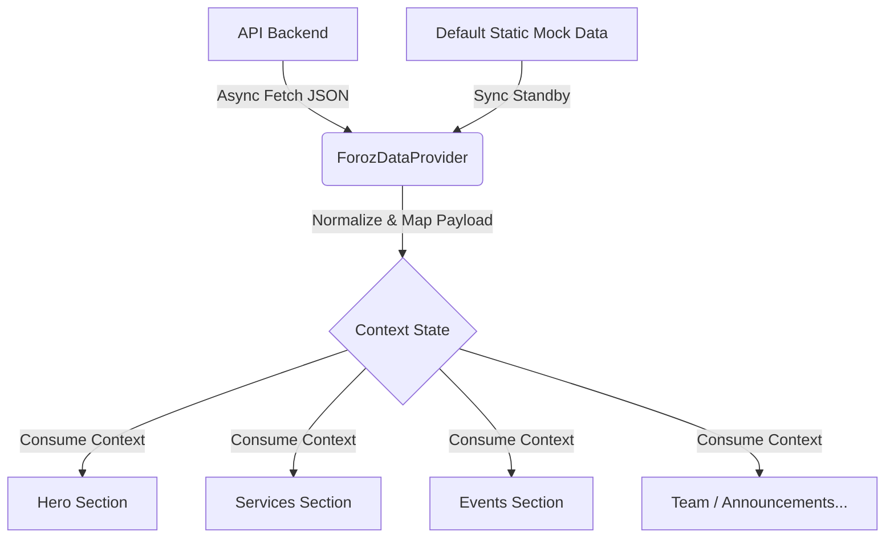

# Technical Report: FOROZ Nonprofit Organization Homepage

This technical report provides a comprehensive architectural and engineering analysis of the frontend codebase for the **FOROZ Nonprofit Organization Homepage** project. 

---

## 1. Executive Summary

The **FOROZ Nonprofit Organization Homepage** is a modern, responsive single-page application (SPA) designed to showcase the mission, services, announcements, events, and collaborations of FOROZ—a nonprofit organization founded on September 6, 2025, dedicated to empowering youth through education, skills development, and equitable opportunities.

Built on top of the **React** framework using **Vite**, **TypeScript**, and **Tailwind CSS**, the application features:
- A rich, animated user experience driven by **Framer Motion** and **Lucide Icons**.
- A resilient data synchronization layer utilizing a custom **Context API** provider.
- An adaptive REST client integration with multi-endpoint routing fallbacks, ensuring high fault tolerance during backend API state changes or network outages.
- Modular, decoupled components that consume cleanly isolated sections of the global layout context.

---

## 2. Project Identity & Configuration

* **Project Title (HTML shell):** `FOROZ Nonprofit Homepage` (defined in [index.html](file:///d:/Web%20Projects/workshop/blog/index.html))
* **Package Name:** `magic-patterns-vite-template`
* **Version:** `0.0.1`
* **Application Framework:** React 18.3.1 (using client-side rendering)
* **Build Engine:** Vite 5.2.0 (leveraging `@vitejs/plugin-react`)
* **Type System:** TypeScript 5.5.4 (configured with ES2020 target and strict compiler options)
* **Styling Pipeline:** Tailwind CSS 3.4.17, PostCSS, and Autoprefixer
* **Target Environment:** Node 20+, browser clients supporting modern ECMAScript specifications (ES2020+)

---

## 3. Repository Architecture & Layout

The directory layout separates concerns into services (API calls), context (global state management, mapping, and caching), and components (modular UI sections).

```text
blog/
│
├── index.html                  # HTML entry shell targeting '#root'
├── package.json                # Project dependencies, metadata, and scripts
├── postcss.config.js           # PostCSS plugins configuration
├── tailwind.config.js          # Tailwind CSS layout content limits
├── tsconfig.json               # Main TypeScript compilation options
├── tsconfig.node.json          # Vite compiler-specific TypeScript options
├── vite.config.ts              # Vite configuration using the React plugin
├── .eslintrc.cjs               # ESLint configuration for static analysis
├── TECHNICAL_REPORT.md         # This technical report
│
└── src/
    ├── main.tsx                # React runtime entry point (mounts ForozDataProvider and App)
    ├── App.tsx                 # Core page layout composition
    ├── index.css               # Font imports, Tailwind directives, and custom keyframe animations
    ├── vite-env.d.ts           # Vite typescript environment interface declarations
    │
    ├── services/
    │   └── api.ts              # Custom REST client helpers, data parsing, and asset resolution
    │
    ├── context/
    │   └── ForozDataContext.tsx # Context API provider, default static data, mapping models
    │
    └── components/             # Reusable UI component modules
        ├── AboutSection.tsx
        ├── AnnoucementSection.tsx (Contains AnnouncementSection)
        ├── BoardMembersSection.tsx
        ├── CTASection.tsx
        ├── CollaborationSection.tsx
        ├── ContactSection.tsx
        ├── CoreValuesSection.tsx
        ├── EventsSection.tsx
        ├── Footer.tsx
        ├── HeroSection.tsx
        ├── ImpactSection.tsx
        ├── MissionVisionSection.tsx
        ├── Navbar.tsx
        └── ServicesSection.tsx
```

---

## 4. Component Composition & Page Layout

[App.tsx](file:///d:/Web%20Projects/workshop/blog/src/App.tsx) composes the entire page structure inside a single scrollable container styled with dynamic selection colors:

```tsx
export function App() {
  return (
    <div className="min-h-screen flex flex-col bg-slate-50 font-sans selection:bg-blue-200 selection:text-blue-900">
      <Navbar />

      <main className="flex-grow">
        <HeroSection />
        <AboutSection />
        <MissionVisionSection />
        <CoreValuesSection />
        <ServicesSection />
        {/* <ImpactSection /> */}
        <AnnouncementSection />
        <EventsSection />
        <CollaborationSection />
        <BoardMembersSection />
        <CTASection />
        <ContactSection />
      </main>

      <Footer />
    </div>
  );
}
```

> [!NOTE]
> The `ImpactSection` (number counter) is currently implemented but commented out in the layout tree of `App.tsx`. It can be safely re-enabled to display numeric metrics.

---

## 5. Architectural Deep Dives

### A. Dynamic & Resilient Data Context ([ForozDataContext.tsx](file:///d:/Web%20Projects/workshop/blog/src/context/ForozDataContext.tsx))

The application uses React's Context API to manage and distribute content rather than relying on heavy third-party libraries (e.g., Redux). The provider acts as a **fault-tolerant sync client** between the API and the components.



#### Core Responsibilities:
1. **Fallback Design:** Holds a comprehensive `defaultData` object that reflects all texts, links, items, and social media references. If the API cannot be reached, the application falls back seamlessly to this default state without breaking the user experience.
2. **Endpoint Mapping:** Maps incoming payloads dynamically using strict mapping routines (`mapEvents`, `mapBoardMembers`, `mapAnnouncements`, etc.) to guard against `null`, `undefined`, or mismatching types.
3. **Key Normalization:** Resolves snake_case fields commonly returned by backends (such as `short_description`, `termination_date`, `posted_by`) and exposes them as camelCase parameters for typescript files.

---

### B. Custom Resilient REST Service Layer ([api.ts](file:///d:/Web%20Projects/workshop/blog/src/services/api.ts))

The API service file is written in vanilla TypeScript utilizing the native browser `fetch` API. It includes advanced parsing mechanisms to survive data layout changes.

#### Key Features:

1. **Sequential Endpoint Fallbacks (`fetchFirstJson`):**
   To support flexible backends or evolving routes, the client accepts an array of routes and fetches them in order, returning the first successful response:
   ```typescript
   export const fetchFirstJson = async (paths: string[]) => {
     let lastError: unknown;
     for (const path of paths) {
       try {
         return await fetchJson<unknown>(path);
       } catch (error) {
         lastError = error;
       }
     }
     if (lastError) {
       console.warn(`Unable to fetch ${paths.join(' or ')}`, lastError);
     }
     return null;
   };
   ```
   This is used to resolve URLs such as `['/content/', '/site-content/', '/home/', '/homepage/']` for general homepage text.

2. **Fuzzy Record/Array Extraction (`extractArray` and `extractRecord`):**
   If the API returns data nested inside wrapper properties (like `{ data: [...] }` or `{ results: [...] }`), these helpers inspect common packaging keys (`results`, `items`, `data`, `events`, etc.) or dynamically locate the first array present in the object, making the client highly resilient to API structure adjustments.

3. **Dynamic Asset Path Resolution (`resolveAssetUrl`):**
   Checks if an asset link (like user avatars or event banners) is absolute (HTTP, data:, blob:) or relative. Relative paths are automatically prefixed with the backend source `API_ORIGIN` dynamically.

---

### C. Style System and Micro-Animations

The styling is handled through **Tailwind CSS** directives combined with custom CSS classes in [index.css](file:///d:/Web%20Projects/workshop/blog/src/index.css).

1. **Text Gradient Utility:**
   The client-specific header style `.text-gradient` uses utility-first color ranges to create modern, polished visuals:
   ```css
   .text-gradient {
     @apply bg-clip-text text-transparent bg-gradient-to-r from-blue-600 via-indigo-600 to-purple-600;
   }
   ```
2. **Animation Keyframes:**
   Dedicated CSS animations (`fadeIn` and `scaleUp`) run side-by-side with Framer Motion transitions to power custom dialog overlays and modals with spring transitions:
   ```css
   .animate-fade-in {
     animation: fadeIn 0.2s ease-out forwards;
   }
   .animate-scale-up {
     animation: scaleUp 0.25s cubic-bezier(0.34, 1.56, 0.64, 1) forwards;
   }
   ```

---

## 6. Functional Description of UI Sections

The interface is broken down into fourteen modular components:

| Component | Target CSS Selector ID | Context Consumption | Visual / Interactivity Details |
|---|---|---|---|
| **Navbar** | — | — | Fixed header, scrolling transitions, logo display, responsive overlay, and external Admin Login CTA (`api/user/login`). |
| **HeroSection** | `#home` | `hero` | Split-screen grid. Dynamic title gradients, CTA buttons, and interactive floating animated cards representing growth. |
| **AboutSection** | `#about` | `about` | Organization background narrative and custom-designed Feature Cards. |
| **MissionVisionSection** | — | `missionVision` | Dual mission/vision cards featuring subtle scale transitions on hover. |
| **CoreValuesSection** | — | `coreValues` | 7 core values cards with dynamic Lucide icons (`Heart`, `Star`, `ShieldCheck`, `Users`, `Lightbulb`, `Handshake`, `Leaf`) and background shades. |
| **ServicesSection** | `#services` | `services` | Multi-column grid representing programs, backed by gradient styling. |
| **AnnouncementSection** | `#announcements` | `announcements` | Dynamic articles featuring image fallbacks, date badges, description fadeout, and pop-up details modals. |
| **EventsSection** | `#events` | `events` | Cards for upcoming workshops/events. Details modals support direct registration link outs. |
| **CollaborationSection**| `#collaborations` | `collaborations` | Partner collaboration highlights, featuring detail modals and outgoing URLs. |
| **BoardMembersSection** | `#team` | `boardMembers` | Profile circles for board members, including social media icons (`Linkedin`, `Facebook`, etc.) and full biography modals. |
| **CTASection** | — | `cta` | Dynamic newsletter/volunteer call-to-action layout pointing to volunteer forms. |
| **ContactSection** | `#contact` | `contact` | Standard contact details grid (Email, Address, Phone) alongside a submission form. |
| **ImpactSection** | — | `impact` | *Currently Commented Out*. Viewport-triggered count-up animations for key metrics. |
| **Footer** | — | `footer` | Section navigation links, copyrights, legal items, and social media indicators. |

---

## 7. Quality, Reliability, and Roadmap Recommendations

### 1. Rename Component Filename Typo
> [!IMPORTANT]
> The filename of the announcement section component contains a minor typo: [AnnoucementSection.tsx](file:///d:/Web%20Projects/workshop/blog/src/components/AnnoucementSection.tsx) (missing the second 'n'). However, inside the file, the function is exported correctly as `AnnouncementSection` and imported in [App.tsx](file:///d:/Web%20Projects/workshop/blog/src/App.tsx) using the typo-containing filename. Standardizing this filename to `AnnouncementSection.tsx` will avoid confusion in future code generations.

### 2. Standardize Configuration Environment Variables
API routing parameters like `API_ORIGIN` and `API_BASE_URL` in [api.ts](file:///d:/Web%20Projects/workshop/blog/src/services/api.ts) should be configured uniformly using local environment files (e.g. `.env.local` or `.env.production`) rather than relying on inline string defaults (`'http://localhost:8000'`).

### 3. Re-enable the Impact Counter Section
Since the [ImpactSection.tsx](file:///d:/Web%20Projects/workshop/blog/src/components/ImpactSection.tsx) is fully coded and functional (containing viewport detection and eased count-up animations), it can be reactivated by uncommenting `<ImpactSection />` in [App.tsx](file:///d:/Web%20Projects/workshop/blog/src/App.tsx).

---

## 8. Development & Build Script Execution

The project defines standard package manager entry points in `package.json`:

* **Start Development Mode:**
  ```bash
  npm run dev
  ```
* **Build Production Bundle:**
  ```bash
  npm run build
  ```
  Generates minified HTML, CSS, and JS chunks under the `/dist` directory.
* **Launch Production Preview:**
  ```bash
  npm run preview
  ```
* **Run Static Code Linter:**
  ```bash
  npm run lint
  ```
